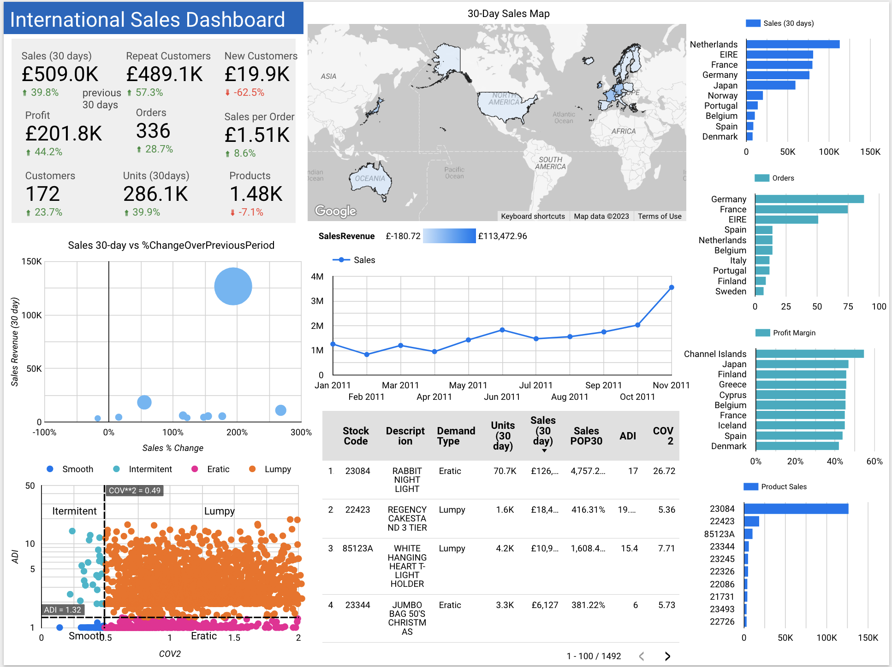
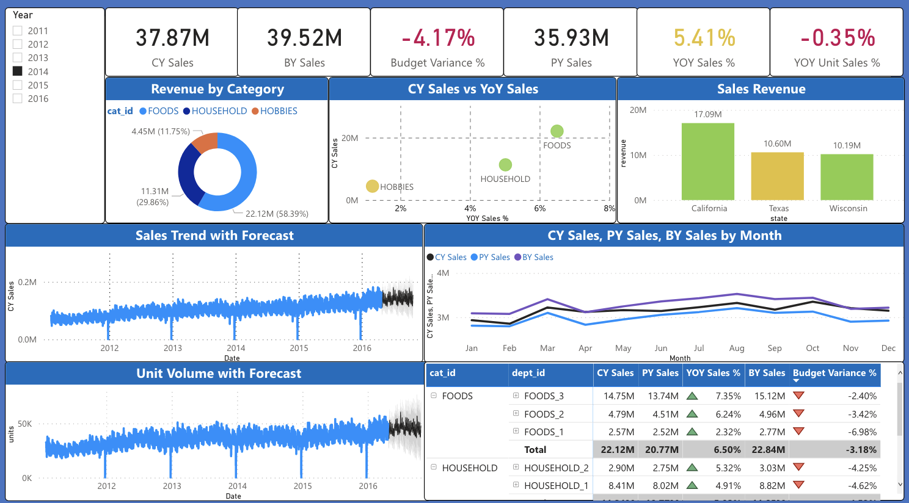

# Sales  Analytics - Notebooks, BI Dashboards, and Articles

**Online International Sales**

[EDA and BI transforms](https://github.com/Aljgutier/sales_analytics) - Load, explore, and transform the UCI online sales dataset in preperation for BI.

[International Sales Dashboard](https://lookerstudio.google.com/reporting/5cfdf7d0-85b1-4be2-ab36-af77665778be/page/IkNHD) - Looker Studio, BI Dashboard designed for International Sales Director based on online sales UCI data. The insights include profit, demand statistics, and sales revenue and units by country, and the ability to explore filter and explore for each product.

<figure>
 
 <figcaption>
Looker Studio International Sales Dashboard
</figcaption>
 </figure>

**Sales BI with M5 (Walmart) Dataset**

[M5 EDA and BI transforms](https://github.com/Aljgutier/sales_analytics/blob/main/m5_eda_bi.ipynb) - Load, explore, transform the M5 Walmart dataset. The data is transformed into several data files similar to a "Star Schema" suitable for an analytics data warehouse and Power BI data model.

[Power BI Sales Dashboard based on M5 Dataset](
https://app.powerbi.com/groups/me/reports/9679493e-7c0d-4a62-8ee3-6cfb00fe5fe0/ReportSection)

<figure>
 
 <figcaption>

</figcaption>
 </figure>

 [Sales BI with the M5/Walmart dataset and a State-of-the-Art Data Intelligence Architecture](https://aljgutier.github.io/posts/AIBI%20Analytics/20220205_salesbi_and_architecture/) - The article describes the process of creating a BI reporting dashboard within a state-of-the-art data intelligence system. For demonstration purposes a BI reporting dashboard is developed using the M5 Walmart sales dataset